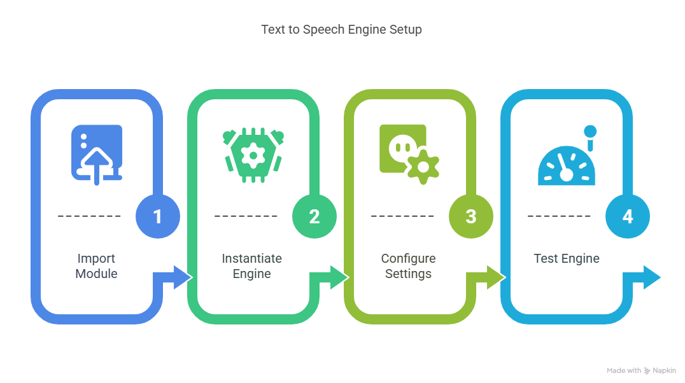

# Talking Code - Text to Speech for Your Code




## Description

Welcome to the **Talking Code** repository! This project demonstrates how to utilize a text-to-speech engine to make your code talk. By converting your code into speech, you can enhance accessibility and improve the learning experience for visually impaired individuals. This repository serves as a guide to implementing text-to-speech functionality in your programming projects.


## Features

- Convert code snippets into spoken language.
- Enhance accessibility for visually impaired developers.
- Learn how to integrate a text-to-speech engine into your projects.

## Getting Started

To get started with the **Talking Code** project, follow these steps:

1. Clone the repository to your local machine.
2. Install the required dependencies listed at the top of the notebook.
3. Explore the example code provided in the repository and experiment.
4. Run the notebook to hear your code come to life!


## Usage

Here's a simple example of how to use the text-to-speech functionality:

```python
import pyttsx3

# Initialize the text-to-speech engine
engine = pyttsx3.init()

# Code snippet to be spoken
code_snippet = "for i in range(5):\n    print('Hello, world!')"

# Convert and speak the code snippet
engine.say(code_snippet)
engine.runAndWait()

