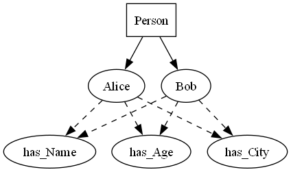

    
# Talking Code 

## Application for building sophisticated text to speech 

    

    

This data science solution will establish a **text to speech engine**.  The text to speech engine will allow you to have your code talk to the users. it will make your code easier to understand and use.  

The **pyttsx3 library** is a text-to-speech conversion library in Python that works offline and is compatible with both Python 2 and 3. It allows developers to convert text data into spoken words using various speech engines, such as SAPI5 on Windows, NSSpeechSynthesizer on macOS, and espeak on Linux. This library is commonly used for creating applications that require vocal output, such as accessibility tools, voice assistants, and educational software.

 % AI Exploratory Project - Lessons Learned, Findings and a Brave New World
% Joe Eberle
% July 2025

# 📄 Executive Summary Experimental AI Health Assistant Using Open Source Tools

This project explored the feasibility of leveraging open source and free AI tools to develop a private, ethical, and highly accessible AI driven health assistant. The core goal was to determine whether such an approach could democratize advanced AI capabilities, offering a low-cost solution to support population health needs, individual health queries, providers, epidemiologists, and communities impacted by social determinants of health. By building on freely available AI frameworks and open architectures, we sought to establish whether this model could provide meaningful health insights without relying on costly proprietary platforms.

To achieve this, the team developed a natural language chatbot platform that ingests user questions in conversational form, dynamically generates the appropriate SQL queries, and runs them against a secure, private population health data warehouse. The results are then processed by a large language model (LLM) that formulates natural language responses tailored to the users needs. The system supports multiple personas — including patient, physician, nutritionist, and epidemiologist — ensuring that responses are contextually appropriate and aligned with the users perspective.

A critical innovation in this experiment is the incorporation of a retrieval-augmented generation (RAG) model that actively **learns** from validated interactions, using positive reinforcement to improve accuracy and relevance over time. Coupled with robust ethical guardrails and a fact-checking layer, the platform ensures that responses adhere to privacy standards, avoid inappropriate content, and steer clear of practicing medicine beyond approved scopes. These safeguards were essential to maintain trust and uphold the ethical responsibilities inherent in handling sensitive health data.

Preliminary results are highly promising. The system has demonstrated the ability to correctly answer over 80% of health-related queries with an 80% confidence threshold, aligning with the original project targets. This suggests that even with exclusively open source or freely licensed components, it is possible to deliver sophisticated, domain-aware, and ethically compliant health insights at minimal cost. This proof-of-concept highlights a compelling path forward for using accessible AI technologies to serve under-resourced populations, including Medicaid recipients and communities disproportionately affected by social determinants.

Looking ahead, this experimental platform holds significant potential for broader deployment across regional health information organizations (RHIOs), health information exchanges (HIEs), and community-based organizations. By providing these stakeholders with an affordable, privacy-focused, and ethically governed AI assistant, the initiative aims to advance health equity and support underserved populations with the same caliber of data-driven insight typically reserved for high-cost systems. Continued refinement of the platforms learning models, ethical guardrails, and persona-based interactions will be essential to maximize impact and ensure sustainable, scalable success.

# 🧠 Executive Overview Advancing the AI Health Assistant for Community Impact

## 📌 Current Phase Summary

The AI Health Assistant has successfully demonstrated its ability to
- Accept **natural language questions** from users across disciplines
- Automatically generate and execute **structured queries** against a secure, **private population health database**
- Return clear, context-aware **natural language responses**, maintaining full data privacy and local control

This first phase validated that AI can be used safely and efficiently to support providers, public health teams, and analysts in understanding their populations — without relying on third-party cloud models.

---

## 🚀 Next Phase Vision Expanding Capabilities Through Agentic Workflows

In the next phase, we will expand the systems intelligence by embedding **agentic workflows** — enabling the assistant to **think, reason, and act** on behalf of its users. These capabilities will be tailored to serve multiple stakeholders in the public health ecosystem.

---

## 👩‍⚕️ For Providers

### 1. Risk-Stratified Chase Lists  
Generate dynamic, prioritized patient lists for specific diseases or risk profiles to support **targeted outreach** and **personalized care management**.

### 2. Understanding CCDs and Clinical Notes  
Use advanced NLP to extract insights from **Continuity of Care Documents (CCDs)** and **physician notes**, enabling a fuller picture of patient health beyond structured EHR data.

### 3. Multi-Gap Closure Strategy  
Identify opportunities to **close multiple care gaps in a single visit**, increasing efficiency and compliance with value-based care goals.

---

## 🏥 For Population Health & NYS Department of Health Analysts

### 4. Epidemiology Reports  
On-demand generation of **population-level reports** to track disease burden, chronic conditions, and comorbidities across communities.

### 5. Geographic Hotspotting  
Interactive mapping to highlight **neighborhoods most affected** by chronic diseases like cancer, diabetes, and obesity.

### 6. Social Determinants of Health (SDOH) Analysis  
Identify regions facing **economic or structural disparities**, such as **food deserts**, lack of **behavioral health support**, or **housing instability**.

### 7. Syndromic Surveillance  
Enable real-time detection and visualization of **emerging health threats**, including **infectious disease outbreaks**, **environmental poisonings**, or **COVID-19** surges.

---

## 📊 For Researchers and Data Scientists

### 8. Advanced Analytics and Feature Discovery  
Support for **feature reduction**, **principal component analysis (PCA)**, and other techniques to help discover new patterns, predictors, and research opportunities in complex health data.

### 9. Standardized Natural Language Reports  
Allow users to generate **standardized population health reports** using simple commands like  
_Provide me with the latest hospital admissions, discharges, and transfers within the last ninety days._

---

## 📈 Strategic Impact & Request for Support

This next phase represents a transformative opportunity to
- Equip providers and public health agencies with **AI-powered decision tools**
- Improve health equity by identifying and addressing **community-level disparities**
- Drive **actionable insights** in real-time, across structured and unstructured datasets
- Provide a **replicable, privacy-preserving model** for other counties and regions

We seek partnership with the **New York State Department of Health** to
- Pilot these advanced capabilities in high-need areas
- Establish shared infrastructure for AI-driven population health
- Create a roadmap for scaling this solution to other communities and health organizations statewide

---

## ✅ Next Steps

- Finalize agentic workflow architecture and use case selection
- Conduct pilot testing with local provider and public health teams
- Evaluate performance, usability, and impact across multiple user groups
- Document cost-savings, quality improvements, and community benefit

## HealtheLink AI exploration architecture

Heres a breakdown of each component in the provided architecture diagram with a one- or two-sentence description

---

### 🧑‍💬 **NLP Question** - Optionally Speech to Text 

* The user inputs a natural language question, initiating the query process. To assist in open access the user may merely speak the question and 
the AI assistent converts to Text. 

### 🧠  Prompt for conversion to SQL 

* Vanna AI orchestrates the translation of natural language questions into SQL queries using vector search, prompt engineering, and an LLM. ***(we are using vanna.ai)***

### 🔍 **Search to Identify Intent** - uses training or finds matching queries  

* Retrieves relevant schema, DDL, documentation, and sample answers from the vector store to inform the LLM. ***(we are using vanna.ai)***

### ✍️ **Prompt**

* Constructs a tailored prompt using context from search results, then sends it to the LLM to generate an SQL query. ***(we are using vanna.ai)***

### 📚 **Any Vector Store for RAG**

* Stores indexed metadata such as database schemas, documentation, and previous answers for semantic retrieval. ***(we are using chromadb)***

### 🧠 **Any LLM** 

* A large language model (e.g., GPT) that receives the crafted prompt and generates the SQL query. ***(we are using 7.5B parameter local )***

### 💾 **Any SQL Database**

* The target database where the generated SQL query is executed to retrieve real-time data.  ***(we are using postgres)***

### 🟣 **SQL Query Output Area**

* Displays query results in tabular or chart form (e.g., via Plotly) and enables follow-up questions based on the result.

### ✅ **Results Correct? (Yes path)**

* If results are correct, the process completes and may offer visualizations or continued interaction.

### ❌ **Results Correct? (No path)**

* If results are incorrect, the user can manually revise the query to correct it.

### 🛠️ **Manual Query Rewrite**

* The user edits or writes a new SQL query, bypassing the LLM, to get accurate results.

### 🔁 **Correct Query (Loop back)**

* The corrected SQL query is rerun through the system for proper output.

# HealtheLink AI Exploration Architecture

This document outlines the architecture and workflow for a voice- and text-enabled AI-driven query engine deployed on AWS. The solution leverages a local LLM, Vanna.AI, and a Postgres database, with all components containerized and integrated via secure, scalable services.

---

## 🔷 Architecture Components

### 🧑‍💬 User Interaction NLP Question Input (Optional Speech-to-Text)

Users initiate queries via natural language, optionally using speech-to-text capabilities for accessibility. Input is securely transmitted via HTTPS to the AI processing engine.

### 🧠 Prompt Generation (via Vanna.AI)

Vanna.AI orchestrates the conversion of natural language into SQL using vector search, context-aware prompt engineering, and a connected local LLM. This component runs in a secured container within a private VPC.

### 🔍 Search to Identify Intent

The search module queries the vector store to retrieve relevant metadata (DDL, schema documentation, validated queries) to provide context for prompt construction. This ensures accurate translation of user intent.

### ✍️ Prompt Engineering (via Vanna.AI)

Search results are used to construct a prompt dynamically. This prompt is fed to the LLM to generate SQL. Prompt crafting follows a secure, stateless design and is isolated within a sandboxed Lambda or container environment.

### 📚 Vector Store (RAG)

A vector database (ChromaDB) stores embeddings of structured metadata (schemas, definitions, documentation). It supports semantic search with role-based access control and encryption-at-rest.

### 🧠 Local LLM

A containerized 7.5B parameter LLM processes the engineered prompt and returns SQL. The model runs within AWS infrastructure (e.g., ECS, EC2, or EKS) with access logging, isolated compute, and encrypted volumes.

### 💾 SQL Execution Layer

PostgreSQL serves as the backend database. Queries are executed via secure, read-only connections. Activity is logged and monitored using AWS CloudWatch and GuardDuty.

### 🟣 Query Output & Visualization

Query results are displayed using Plotly Dash or Streamlit within a web-based UI. The application supports interactive charts and enables follow-up questions.

---

## 🧪 Output Validation & Feedback Loop

### ✅ Correct Results (Positive Path)

If the user confirms the output is correct, results can be exported or visualized. The interaction may continue via natural language follow-up questions, forming a conversational loop.

### ❌ Incorrect Results (Negative Path)

If results are unsatisfactory, the user is prompted to refine the question or manually adjust the query.

### 🛠️ Manual Query Rewrite

Users can bypass the AI to directly input or edit SQL queries. A manual override interface is provided with built-in syntax validation and limited access to prevent unsafe operations.

### 🔁 Query Loopback

Any corrected query can be resubmitted, with the process rerunning through the execution and visualization layer for re-validation.

---

## 🔐 Security Architecture

* **Encryption** All data in transit is secured with TLS 1.2+. All data at rest (vector store, database, logs) is encrypted with AWS KMS.
* **Firewalls** AWS Security Groups and Network ACLs restrict inbound and outbound traffic. Only approved services can communicate with the internal components.
* **IAM & Access Control** Fine-grained IAM policies restrict access to compute, storage, and database services.
* **Audit Logging** All access and system activity is logged using AWS CloudTrail and CloudWatch.
* **Secrets Management** Environment variables and credentials are managed via AWS Secrets Manager or Parameter Store.
* **Vulnerability Scanning** Containers are regularly scanned using Amazon Inspector or equivalent.
* **Schema  Database Filtering**  What access is required to protect certain aspects of the database. 

## 🧪 Establishing Ground Truth with Known Datasets

To ensure the accuracy and reliability of our AI health assistant, we integrate a set of **well understood, static datasets** as a consistent testing benchmark. These include the widely used Kaggle Titanic Survival dataset, the Palmer Penguins dataset, and a curated sample of static healthcare data that mirrors real-world structures without containing protected health information (PHI).

These datasets serve as our systems ground truth—a trusted foundation of known inputs and expected outputs against which we can continuously evaluate performance. By comparing the assistants generated SQL and natural language outputs against these stable reference datasets, we can

Validate that the **retrieval augmented generation (RAG)** process is selecting the appropriate tables and columns,

Ensure consistent accuracy in SQL query generation and execution,

Test and retrain models without introducing real world data drift.

Even as the live population health warehouse evolves—with new tables, updated schemas, or shifts in patient demographics—our static datasets remain fixed. This provides a reliable, repeatable environment for regression testing, model tuning, and quality assurance.

Ultimately, this hybrid approach allows us to maintain real-time adaptability with live data while anchoring system behavior in a controlled, measurable test bed, helping us track improvements and prevent unintended degradation of model performance over time.

## 👍👎 Continuous Learning Through Feedback
A critical feature of our AI assistant is the thumbs-upthumbs-down feedback mechanism, which empowers users to quickly rate the relevance and accuracy of each response. This system serves as the foundation for a continuous learning loop, allowing us to track model performance in real-world scenarios.

When a user selects 👍 (thumbs up), it signals that the assistants SQL generation and natural language explanation were accurate and useful. These successful interactions are stored as positive training samples, helping reinforce correct patterns in both prompt engineering and SQL logic during future fine-tuning.

Conversely, a 👎 (thumbs down) rating indicates that the response was incomplete, incorrect, or misunderstood the users intent. These interactions are flagged and categorized to help data scientists and prompt engineers identify common failure modes. They are then used to

1. Improve the retrieval logic (RAG layer),
2. Adjust prompt templates (via Vanna.AI),
3. Refine table and column mappings,
4. And update LLM behavior for edge cases.

This **human loop feedback** not only increases accuracy over time, but also ensures that the assistant evolves alongside real-world data, emerging health priorities, and local user needs.

By integrating this lightweight feedback loop, we bridge the gap between static AI deployments and dynamic, user-informed retraining, resulting in a smarter, more trustworthy assistant for population health insights.

## Ethical Guardrails & Domain Topic Classifier

This component ensures your AI assistant maintains safety, ethical standards, and domain relevance by actively monitoring and classifying the following categories

#### 1. Sexism
Flags language that discriminates based on gender or reinforces harmful stereotypes.

#### 2. Racism
Identifies racially biased, prejudiced, or discriminatory statements.

#### 3. Inappropriate Content
Detects sexual, violent, or otherwise unacceptable language that violates usage policies.

#### 4. Hostility
Captures aggressive, threatening, or harassing language directed at individuals or groups.

#### 5. Practicing Medicine
Ensures the assistant does not provide medical diagnosis or treatment advice outside its scope.

#### 6. Protected Health Information (PHI)
Monitors for potential exposure or misuse of personally identifiable health data to maintain HIPAA compliance.

#### 7. Domain Classification
Determines whether a query is within the approved professional or business domain.

#### 8. Topic Classification
Further categorizes questions or statements by subject area (e.g., epidemiology, billing, technical troubleshooting) to route or respond appropriately.

✅ Short summary

These guardrails help ensure that all interactions stay ethical, compliant, and domain-appropriate, protecting both users and the organization.

## Layering Intelligence

Building a super intelligent AI assistant involves integrating various layers of artificial intelligence technologies, each contributing uniquely to the assistants capabilities. These layers collectively enhance the assistants ability to understand, process, and respond to user inputs in a meaningful way. Heres an enumerated list of AI layers that you might consider for such a system

1. **Natural Language Processing (NLP)**
   - **Purpose** Enables the AI to understand and generate human language. Its used for parsing, understanding context, sentiment analysis, and generating coherent, contextually appropriate responses.
   - **Application** Can be used to answer general questions, assist in tasks like booking appointments, and understand user commands or queries.

2. **Machine Learning Classifiers**
   - **Purpose** Classifies inputs into predefined categories based on learned patterns from data.
   - **Application** Identifies the intent behind queries or commands, categorizes user requests, and triggers appropriate workflows or responses.

3. **Neural Networks**
   - **Purpose** Models complex patterns and predictions using layers of neurons. Essential for deep learning tasks.
   - **Application** Powers complex decision-making processes, image and speech recognition, and can enhance the personalization of responses based on user behavior and preferences.

4. **Generative AI**
   - **Purpose** Uses models like GPT (Generative Pre-trained Transformer) to generate text that mimics human writing styles and content generation.
   - **Application** Used to create detailed and nuanced responses to user queries, generate creative content, or even draft emails and reports.

5. **Speech Recognition**
   - **Purpose** Converts spoken language into text. This is crucial for voice-activated systems.
   - **Application** Allows users to interact with the AI assistant through voice commands, making the assistant accessible in hands-free scenarios like driving or cooking.

6. **Recommendation Systems**
   - **Purpose** Analyzes patterns in user data to predict and recommend relevant items or actions.
   - **Application** Suggests actions, answers, or content based on the users past behavior, enhancing user experience by personalizing interactions.

7. **Query Generation for Databases**
   - **Purpose** Automatically formulates and executes database queries based on user commands or questions.
   - **Application** Retrieves and manipulates data from internal or external databases without manual SQL input, useful in business intelligence and data-driven decision-making.

8. **Semantic Analysis**
   - **Purpose** Goes beyond basic keyword recognition to understand the deeper meaning and relationships in text.
   - **Application** Helps in understanding complex queries, resolving ambiguities in human language, and ensuring the context is maintained across conversations.

9. **Emotion and Sentiment Analysis**
   - **Purpose** Analyzes the emotional tone behind texts or spoken inputs.
   - **Application** Adjusts responses based on the users emotional state or sentiment, which is particularly useful in customer service scenarios.

10. **Robot Process Automation (RPA)**
    - **Purpose** Automates repetitive tasks by mimicking human interactions with digital systems.
    - **Application** Handles routine backend tasks triggered by user requests, such as booking tickets or updating records, efficiently and without human error.

By layering these technologies, a super intelligent AI assistant can perform a wide range of tasks, from simple question answering to complex problem solving and personalized interactions. Each layer enhances the systems ability to understand and interact in more human-like ways, leading to richer user experiences and more effective assistance.

The proposed 5-layer data validation technique offers a comprehensive approach to ensuring data quality and accuracy across various stages. Below, I will refine and expand each layer to address potential gaps and enhance the robustness of the validation process

### Layer 1 Descriptive Statistics and Ground Truth Establishment 
- **Enhanced Approach** Utilize `pandas.describe()` to compute summary statistics (mean, median, standard deviation, quartiles) for all numeric columns in the dataset. Establish ground truth by comparing these statistics against historical data or expected ranges predefined by domain experts. Include additional statistical tests such as Z-scores or T-tests for anomaly detection, where deviations from historical norms are flagged for further review.

### Layer 2 SQL Database Integrity and Consistency Check
- **Enhanced Approach** Perform SQL queries to replicate the descriptive statistics calculated in Layer 1 directly from the database. Use assertions in SQL to check that aggregates (sum, average, count, min, max) match those calculated in pandas. Include integrity checks for data types, null values, and referential integrity (e.g., foreign keys). Implement checksum or hash comparisons for entire datasets or critical subsets to ensure no discrepancies between the source data and what is loaded into the database.

### Layer 3 External Validation with Semantic Analysis
- **Refined Approach** Instead of relying on potentially unavailable external internet sources for proprietary data, use semantic analysis technologies to validate data consistency and plausibility. This can involve using NLP tools to understand text datas context and meaning, comparing against a corpus of industry-specific documentation or previously validated datasets. For non-proprietary information, leverage external APIs or datasets for cross-referencing facts.

### Layer 4 Expert Review and Feedback Loop
- **Enhanced Approach** Involve clinical SMEs or domain experts to manually review a random, statistically significant sample of the data, focusing on entries flagged by previous layers as anomalies or outliers. Use their feedback not only to validate the data but also to iteratively improve the data collection and cleaning processes. Record expert feedback and decisions in a learning database to refine the automated checks in Layers 1 and 2.

### Layer 5 Continuous Learning and Model Adjustment
- **New Layer Introduction** Implement machine learning models to predict data quality issues based on patterns identified in historical corrections (from Layer 4 feedback and Layer 1 anomalies). Continuously train and adjust these models as new data and feedback become available. Use this layer to proactively suggest potential errors and improve the overall resilience of the data validation framework.

### Implementing the Approach
1. **Automation and Monitoring** Automate as much of the validation process as possible, especially for Layers 1, 2, and 3. Implement monitoring dashboards to track the status and outcomes of validations, highlighting trends over time and identifying areas for improvement.
2. **Data Governance** Establish a clear data governance framework that outlines the roles and responsibilities for each layer, ensuring that data checks are performed regularly and systematically.
3. **Tool Integration** Integrate validation tools directly into data pipelines and ETL processes. This integration ensures that data quality checks are part of the daily workflow and not a separate, potentially overlooked process.

By refining these layers and introducing a continuous learning component, the data validation technique becomes not only more robust but also adaptive to changes in data patterns and external conditions, ultimately leading to higher data quality and trustworthiness in analytical and operational use cases.

## 7 layer system response score formulation
### (THIS IS NOT THE SAME as CONFIDENCE SORE)

## The proposed 7 layer data (100) system response score offers a comprehensive approach to scoring data responses 

### Layer 1 Descriptive Statistics and Ground Truth Matching (20 points)  
- **Statistical Approach** Utilize inverted `pandas.describe()` to compute summary statistics (mean, median, standard deviation, quartiles) for all numeric columns in the dataset. Establish ground truth by comparing these statistics against historical data or expected ranges predefined by domain experts. Include additional statistical tests such as Z-scores or T-tests for anomaly detection, where deviations from historical norms are flagged for further review.

### Layer 2 Ethical Guardrail Analysis (10 points, 30 total) 
- **Refined Approach** Does the system acccurately identify hatred, bullying, sexism, racism, etc ? 

### Layer 3 SQL Database Integrity and Consistency Check (20 points, 50 total)  
- **Enhanced Approach** Perform SQL queries to replicate the descriptive statistics calculated in Layer 1 directly from the database. Use assertions in SQL to check that aggregates (sum, average, count, min, max) match those calculated in pandas. Include integrity checks for data types, null values, and referential integrity (e.g., foreign keys). Implement checksum or hash comparisons for entire datasets or critical subsets to ensure no discrepancies between the source data and what is loaded into the database.

### Layer 4 External Validation with Semantic Analysis (5 points, 55 total) 
- **Refined Approach** Instead of relying on potentially unavailable external internet sources for proprietary data, use semantic analysis technologies to validate data consistency and plausibility. This can involve using NLP tools to understand text datas context and meaning, comparing against a corpus of industry-specific documentation or previously validated datasets. For non-proprietary information, leverage external APIs or datasets for cross-referencing facts.

### Layer 5 Expert Clinical Review and Feedback Loop (5 points, 60 total)  
- **Enhanced Approach** Involve clinical SMEs or domain experts to manually review a random, statistically significant sample of the data, focusing on entries flagged by previous layers as anomalies or outliers. Use their feedback not only to validate the data but also to iteratively improve the data collection and cleaning processes. Record expert feedback and decisions in a learning database to refine the automated checks in Layers 1 and 2.

### Layer 6 Continuity and user feedback (-20 to 20, 80 total)  
    - Did user thumbs down (-20) 
    - Did user ask same question a different way (-5)     
    - Did user leave after response (-5) 
    - Did user continue researching after response (+10) 
    - Did user thumbs up  (+20)     

### Layer 7 Performance (20 points, 100 total)  
- **New Layer Introduction** Implement machine learning models to predict data quality issues based on patterns identified in historical corrections (from Layer 4 feedback and Layer 1 anomalies). Continuously train and adjust these models as new data and feedback become available. Use this layer to proactively suggest potential errors and improve the overall resilience of the data validation framework.

### Implementing the Approach
1. **Automation and Monitoring** Automate as much of the scoring process as possible
2. **Data Governance** Establish a clear data governance framework that outlines the roles and responsibilities that is tune able.

### 📌 Choose your own AI Model   

### **1. GPT-4 (OpenAI, 2024)**  
✅ **Pros** One of the most advanced **general-purpose** LLMs, supporting **complex reasoning** and domain-specific fine-tuning.  
❌ **Cons** High cost and limited control over **training data** for proprietary versions.  

---

### **2. GPT-3.5 Turbo (OpenAI, 2023)**  
✅ **Pros** A **faster and more cost-effective** version of GPT-4, capable of handling **domain-specific tasks** with **prompt engineering**.  
❌ **Cons** Slightly weaker in **long-form reasoning** and lacks fine-tuning options.  

---

### **3. LLaMA 2-Chat (Meta, 2023)**  
✅ **Pros** **Open-source** and **fine-tunable**, optimized for **domain-specific dialogue** in **low-cost environments**.  
❌ **Cons** **Requires extensive fine-tuning** for complex knowledge areas.  

---

### **4. Claude 2 (Anthropic, 2023)**  
✅ **Pros** Prioritizes **ethical AI responses** and **bias reduction**, making it ideal for **sensitive domains** (e.g., **legal, finance, healthcare**).  
❌ **Cons** **Limited accessibility** outside of Anthropics API ecosystem.  

---

### **5. Mistral 7B (Mistral AI, 2023)**  
✅ **Pros** **Lightweight and efficient**, making it ideal for **embedded domain-specific AI systems**.  
❌ **Cons** Limited context window compared to larger models like GPT-4.  

---

### **6. Falcon 40B (Technology Innovation Institute, 2023)**  
✅ **Pros** **State-of-the-art open-source model** designed for high-performance **multi-turn conversations** in specific industries.  
❌ **Cons** **Computationally expensive** to run compared to smaller models.  

---

### **7. GPT-J-6B (EleutherAI, 2021)**  
✅ **Pros** **Early open-source alternative to GPT-3**, still viable for **domain-specific applications** with fine-tuning.  
❌ **Cons** **Outperformed** by newer models in reasoning and language coherence.  

---

### **8. GPT-NeoX-20B (EleutherAI, 2022)**  
✅ **Pros** **Largest open-source GPT model**, designed for **custom domain knowledge fine-tuning**.  
❌ **Cons** Requires **significant compute resources** for deployment.  

---

### **9. BLOOM (BigScience, 2022)**  
✅ **Pros** **Multilingual, open-source model** that supports **fine-tuning** for **domain-specific chatbot applications**.  
❌ **Cons** **Less optimized for chat** compared to LLaMA 2 and Falcon models.  

---

### **10. Alpaca 7B (Stanford, 2023)**  
✅ **Pros** **Fine-tuned version of LLaMA** trained for **instruction-following**, ideal for **knowledge-based conversational AI**.  
❌ **Cons** **Lacks continuous updates**, making it less effective for fast-changing knowledge domains.  

## AI Test Framework

To effectively test a chatbots domain specific knowledge using a large language model like GPT, the proposed methodology 
needs careful design to evaluate the systems inherent capabilities accurately. Below is an expanded and detailed
description of the proposed test methodology, incorporating best practices in AI testing and evaluation.

#### a. **Domain Selection**
1. Kaggle Penguins Database 
2. Kaggle Titanic Database (1309 Passengers) 
3. CDC Chronic disease data Warehouse
4. WNY Healthelink Data Warehouse (1000 people) 

## AI Project Overview 	
## The Brain 	
	1.	What we showed last time (2 months ago)
	2.	whats built and available
	3.	What is turned on and why 
##	Ground Truth - 1863 Validated Questions	
##	Imperical Score Card 	
	1.	**Domain Scorecard** - Big Picture
	2.	**Topic Scorecard** - What areas need improvement
##	Demo -  lines of questioning	
	1.	Health Care  - how many smokers in wny 
	2.	Health Care  - how many children  smokers in wny 
	3.	Penguins   - average beak size per species  
	4.	Titanic  -Average age of passengers
	5.	Penguins -Species by island
	6.	Health Care - Smokers by gender
	7.	Health Care  - Types of cancer
	8.	count of IDA_state disparity 
	9.	Titanic  -survivors by pclass
	10.	Health Care - Smokers by gender and age decade
## Demo -  System Features	
	1.	Show SQL
	2.	Show Table
	3.	Show Graph
	4.	Recommended questions 
	5.	Follow up question 
	6.	Prior questions 
##	Next steps - Training and Hyper parameter tuning  	
	1.	Establishing role based security
	2.	establishing HEL AWS hosting infrastructure
	3.	connecting to HEL database live
	4.	Training on external source  - Understanding wny geography
	5.	Training on IDA - understanding disparity
    6.	Preparing documentation for state
	7.	establishing pilot group 1
	8.	establishing pilot group 2

## 🧠 RAG (Retrieval-Augmented Generation) in Our AI Population Health Assistant
Retrieval-Augmented Generation (RAG) is a powerful AI architecture that enhances large language models (LLMs) by combining text generation with real-time retrieval of relevant knowledge. In our AI-powered Population Health Assistant, RAG plays a central role in enabling accurate, context-aware, and domain-specific responses—especially when working with private healthcare data that cannot be trained into the model itself.

### 🔍 How RAG Enhances Our System
Retrieval Layer (Search & Context Building)

The system uses semantic search to retrieve the most relevant documents, tables, or data dictionary entries from our private population health warehouse.

This ensures the model has accurate and up-to-date medical and local context, even though the base LLM is not trained on this proprietary data.

### Vanna.AI for Prompt Engineering

We use Vanna.AI to fine-tune prompts and train the model on how to interpret population health questions.

Vanna also helps map data elements to the correct tables and columns, improving the models ability to generate valid SQL queries based on user questions.

### LLM-Driven SQL Generation

After relevant context is retrieved, the LLM (such as GPT or a fine-tuned open-source model) generates SQL queries that are optimized for our data warehouse.

The model adapts its output based on user persona (e.g., clinician, epidemiologist, care manager), ensuring personalized and relevant results.

### Execution and Response

The SQL is run securely against the warehouse. The result is then summarized into natural language, allowing users to understand population trends, risk factors, and social determinants insights effortlessly.

Feedback & Learning Loop

Positive user feedback is captured to reinforce and improve retrieval quality and SQL accuracy over time, enhancing the assistants long-term performance.

### ✅ Benefits of RAG in This Context

1.) Accesses live data without needing model retraining.
2.) Keeps PHI secure by retrieving only metadata or query results, not exposing sensitive info.
3.) Increases accuracy by grounding responses in curated, validated datasets.
4.) Supports diverse users by tailoring output to specific health roles and needs.

## Ontology on the Fly

As part of our AI assistant platform, we employ on-the-fly ontology generation using owlready2 to dynamically convert our dataframes into formal OWL ontological models. This approach enables us to structure and semantically enrich the AIs working knowledge, uncovering hidden relationships and hierarchies that might not be immediately apparent in raw tabular data. By translating our data into ontologies, we gain the ability to perform richer reasoning, facilitate more intelligent query expansions, and support advanced use cases like detecting concept overlaps or inconsistencies. This dynamic ontology building helps transform our AI assistant from a simple question-answering tool into a context-aware system that truly understands the interconnected nature of the health data it processes.
 

---

# Appendix 1: talking_code

# 🗣️ Text-to-Speech for Your AI assistant or ANY Python Code

Turn your code into a **talking assistant** using the `pyttsx3` library!
Make your apps easier to understand, more engaging, and accessible — all **offline**.

## 🔧 What is `pyttsx3`?

A lightweight Python library that lets you convert text to speech, without needing an internet connection.

## 💡 Key Features:

###  🧠 Works with **Python 2 & 3**

### 📢 Great for:

1.  Voice assistants
2.  Accessibility tools
3.  Educational apps

## 🚀 Why Use It?

1. 🎧 Make the conversation more natural (more Human)
2. 💬 Add **spoken feedback** to apps and dashboards
3. 🤖 Build smarter, more human interfaces

## ✅ Technology overview of text-to-speech (TTS) in AI assistants

Using text-to-speech (TTS) libraries such as pyttsx3 makes your AI assistant significantly more natural, engaging, accessible, and customizable. Here’s how:

## ✅ Benefits of adding TTS to your AI assistant

### 1. Adds a human-like voice:
Converts your assistant’s text responses into spoken words, so it feels more like a real conversation than reading static text.

### 2. Creates a multi-sensory experience:
By combining visual and auditory channels, it improves understanding, keeps attention longer, and makes interactions more memorable.

### 3. Makes the system more lively and personal:
The assistant sounds like it’s truly “talking with you,” turning it into a friendly, interactive companion.

### 4. Improves accessibility:
Essential for people with visual impairments, reading difficulties, or neurodiverse needs, and helpful for anyone who prefers listening.

### 5. Enables easier hands-free use:
Ideal for situations like driving, cooking, or multitasking, where listening is safer or more practical than reading.

### 6. Allows users to choose a voice that suits them:
Many TTS libraries let users select from different voices, genders, accents, or speech rates — helping them pick a voice that feels most appealing or aligned with the assistant’s intended persona.

## ✅ In short:

🗣️ By adding TTS with libraries like pyttsx3, your AI assistant becomes more human-like, inclusive, adaptable, and enjoyable to interact with, 
creating a **richer, more personalized experience for all users**.

1. 🎧 Make the conversation more natural (more Human)
2. 💬 Add **spoken feedback** to apps and dashboards
3. 🤖 Build smarter, more human interfaces

# 🗣️ Text-to-Speech for Your Python Code

## Process Steps :

1. **Import** the **pyttsx3** text to speech library
2. **Instantiate** the text to speech **engine**
3. **Configure** the TTS dialogues and settings
4. **Test** the Text to Speech Engine

# 🔊 Top 5 Open Source Alternatives to `pyttsx3`

These libraries offer modern, flexible, and in many cases, more powerful approaches to **text-to-speech (TTS)** in Python:

---

### 1. 🗣️ `gTTS` – Google Text-to-Speech
> A lightweight Python wrapper for Google Translate’s TTS API that converts text to mp3 audio files using an internet connection.

---

### 2. 🧠 `TTS` by Coqui
> A deep learning-based library supporting dozens of high-quality multilingual voices, built on Mozilla’s Tacotron and Transformer models.

---

### 3. 🧩 `SpeechSynthesis` (via `pyttsx4`)
> A newer fork and evolving alternative to `pyttsx3` that supports multiple engines with better voice selection and engine detection.

---

### 4. 🎙️ `Festival` (via subprocess or bindings)
> A long-standing, offline TTS system for Linux systems with support for full speech synthesis, scripting, and custom voice training.

---

### 5. 🤖 `ESPnet-TTS`
> A cutting-edge neural TTS framework designed for research and production use, supporting end-to-end models and voice cloning.

---

## 📌 Summary Table

| Library         | Works Offline | Neural Voices | Custom Voices | Notes                        |
|----------------|---------------|----------------|----------------|------------------------------|
| `gTTS`          | ❌            | ✅             | ❌             | Fast, but requires internet  |
| `TTS` (Coqui)   | ✅            | ✅             | ✅             | Powerful and actively developed |
| `pyttsx4`       | ✅            | ❌             | ❌             | Drop-in local replacement     |
| `Festival`      | ✅            | ❌             | ✅             | Unix-based, very customizable |
| `ESPnet-TTS`    | ✅            | ✅             | ✅             | Advanced and research-grade   |

---

---

# Appendix 2: ethical_guardrails

# 🧩 Ethical Guard Rails

#### This solution includes a set of Ethical Guardrails designed to detect and prevent inappropriate, biased, or harmful outputs from AI systems.

> Created by **ThriveAI  ...      Frank Metty, Al Seoud, Joe Eberle**  
> 🗓️ Started: April 18, 2025 
> 📫 Contact: [josepheberle@outlook.com](mailto:josepheberle@outlook.com)  
> 🔗 GitHub: [JoeEberle](https://github.com/JoeEberle/)

## 🧠 Ethical Guardrails 

These guardrails are continuously evolving to align with emerging ethical standards, legal requirements, and community values — supporting safe, inclusive, and responsible AI use.

## 🛡️ Ethical Guardrails Overview
This solution includes a set of Ethical Guardrails designed to detect and prevent inappropriate, biased, or harmful outputs from AI systems. These checks operate in real time and provide an added layer of accountability and safety.

## ⚖️ Guardrail Categories
### 🛑 Racism & Hate Speech Detection
Flags content that includes racial slurs, stereotypes, or any language promoting racial hostility or division.

### 🛑 Sexism & Gender Bias
Identifies and blocks statements that perpetuate **gender based discrimination**, stereotypes, or exclusion.

### 🛑 Inappropriate or Offensive Language
Filters **profane, sexually explicit, or otherwise offensive terms** that are unsuitable for professional or public use.

### 🛑 PHI & Privacy Protection
Prevents the disclosure of **Protected Health Information (PHI)**, personal identifiers, or sensitive private data.

### 🛑 Practicing Medicine
Detects when the AI is attempting to diagnose, prescribe, or make clinical decisions without a licensed provider — ensuring compliance with medical regulations.

### 🛑 Hostility & Threats
Blocks language that includes **violence, bullying, incitement, or aggressive intent** toward individuals or groups.

These guardrails are continuously evolving to align with emerging ethical standards, legal requirements, and community values — supporting safe, inclusive, and responsible AI use.

## Git Commands 
1. git init
2. git add README.md
3. git commit -m "first commit"
4. git branch -M main
5. git remote add origin https://github.com/JoeEberle/ethical_guardrails.git
5. git push -u origin main

---

 

 

# 🗣️ Text-to-Speech for Your AI assistant or ANY Python Code

Turn your code into a **talking assistant** using the `pyttsx3` library!
Make your apps easier to understand, more engaging, and accessible — all **offline**.

## 🔧 What is `pyttsx3`?

A lightweight Python library that lets you convert text to speech, without needing an internet connection.

## 💡 Key Features:

###  🧠 Works with **Python 2 & 3**

### 📢 Great for:

1.  Voice assistants
2.  Accessibility tools
3.  Educational apps

## 🚀 Why Use It?

1. 🎧 Make the conversation more natural (more Human)
2. 💬 Add **spoken feedback** to apps and dashboards
3. 🤖 Build smarter, more human interfaces

## ✅ Technology overview of text-to-speech (TTS) in AI assistants

Using text-to-speech (TTS) libraries such as pyttsx3 makes your AI assistant significantly more natural, engaging, accessible, and customizable. Here’s how:

## ✅ Benefits of adding TTS to your AI assistant

### 1. Adds a human-like voice:
Converts your assistant’s text responses into spoken words, so it feels more like a real conversation than reading static text.

### 2. Creates a multi-sensory experience:
By combining visual and auditory channels, it improves understanding, keeps attention longer, and makes interactions more memorable.

### 3. Makes the system more lively and personal:
The assistant sounds like it’s truly “talking with you,” turning it into a friendly, interactive companion.

### 4. Improves accessibility:
Essential for people with visual impairments, reading difficulties, or neurodiverse needs, and helpful for anyone who prefers listening.

### 5. Enables easier hands-free use:
Ideal for situations like driving, cooking, or multitasking, where listening is safer or more practical than reading.

### 6. Allows users to choose a voice that suits them:
Many TTS libraries let users select from different voices, genders, accents, or speech rates — helping them pick a voice that feels most appealing or aligned with the assistant’s intended persona.

## ✅ In short:

🗣️ By adding TTS with libraries like pyttsx3, your AI assistant becomes more human-like, inclusive, adaptable, and enjoyable to interact with, 
creating a **richer, more personalized experience for all users**.

1. 🎧 Make the conversation more natural (more Human)
2. 💬 Add **spoken feedback** to apps and dashboards
3. 🤖 Build smarter, more human interfaces

# 🗣️ Text-to-Speech for Your Python Code

## Process Steps :

1. **Import** the **pyttsx3** text to speech library
2. **Instantiate** the text to speech **engine**
3. **Configure** the TTS dialogues and settings
4. **Test** the Text to Speech Engine

# 🔊 Top 5 Open Source Alternatives to `pyttsx3`

These libraries offer modern, flexible, and in many cases, more powerful approaches to **text-to-speech (TTS)** in Python:

---

### 1. 🗣️ `gTTS` – Google Text-to-Speech
> A lightweight Python wrapper for Google Translate’s TTS API that converts text to mp3 audio files using an internet connection.

---

### 2. 🧠 `TTS` by Coqui
> A deep learning-based library supporting dozens of high-quality multilingual voices, built on Mozilla’s Tacotron and Transformer models.

---

### 3. 🧩 `SpeechSynthesis` (via `pyttsx4`)
> A newer fork and evolving alternative to `pyttsx3` that supports multiple engines with better voice selection and engine detection.

---

### 4. 🎙️ `Festival` (via subprocess or bindings)
> A long-standing, offline TTS system for Linux systems with support for full speech synthesis, scripting, and custom voice training.

---

### 5. 🤖 `ESPnet-TTS`
> A cutting-edge neural TTS framework designed for research and production use, supporting end-to-end models and voice cloning.

---

## 📌 Summary Table

| Library         | Works Offline | Neural Voices | Custom Voices | Notes                        |
|----------------|---------------|----------------|----------------|------------------------------|
| `gTTS`          | ❌            | ✅             | ❌             | Fast, but requires internet  |
| `TTS` (Coqui)   | ✅            | ✅             | ✅             | Powerful and actively developed |
| `pyttsx4`       | ✅            | ❌             | ❌             | Drop-in local replacement     |
| `Festival`      | ✅            | ❌             | ✅             | Unix-based, very customizable |
| `ESPnet-TTS`    | ✅            | ✅             | ✅             | Advanced and research-grade   |

---

 

    

    
## Getting Started

The goal of this solution is to **Jump Start** your development and have you up and running in 30 minutes. 

To get started with the **Talking Code** solution repository, follow these steps:
1. Clone the repository to your local machine.
2. Install the required dependencies listed at the top of the notebook.
3. Explore the example code provided in the repository and experiment.
4. Run the notebook and make it your own - **EASY !**
    
## Solution Features

- Easy to understand and use  
- Easily Configurable 
- Quickly start your project with pre-built templates
- Its Fast and Automated
- Saves You Time 

## ⚙️ Key Features

- ✅ **Self Documenting** Automatically identifies and annotates major steps in a notebook, making the codebase readable and well structured.
- ✅ **Self Testing** Includes built in **unit tests** for each function to validate logic and ensure code reliability.
- ✅ **Easily Configurable** Uses a simple **config.ini** file for centralized settings and easy customization through key value pairs.
- ✅ **Talking Code** explains itself through inline commentary, helping you understand both **what** it does and **why** it does it.
- ✅ **Self Logging** extends Python’s standard **logging** module for **step by step runtime insights**.
- ✅ **Self Debugging** Includes debugging hooks and detailed error tracing to simplify development and troubleshooting.
- ✅ **Low Code or  No Code** Designed to minimize complexity — most full solutions are under 50 lines of code.
- ✅ **Educational** Each template includes educational narrative and background context to support learning, teaching, and collaborative development.

    