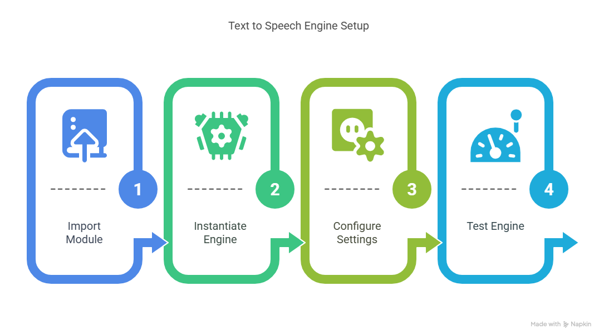

# 🗣️ Text-to-Speech for Your AI assistant or ANY Python Code

Turn your code into a **talking assistant** using the `pyttsx3` library!
Make your apps easier to understand, more engaging, and accessible — all **offline**.

## 🔧 What is `pyttsx3`?

A lightweight Python library that lets you convert text to speech, without needing an internet connection.

## 💡 Key Features:

###  🧠 Works with **Python 2 & 3**

### 📢 Great for:

1.  Voice assistants
2.  Accessibility tools
3.  Educational apps

## 🚀 Why Use It?

1. 🎧 Make the conversation more natural (more Human)
2. 💬 Add **spoken feedback** to apps and dashboards
3. 🤖 Build smarter, more human interfaces

## ✅ Technology overview of text-to-speech (TTS) in AI assistants

Using text-to-speech (TTS) libraries such as pyttsx3 makes your AI assistant significantly more natural, engaging, accessible, and customizable. Here’s how:

## ✅ Benefits of adding TTS to your AI assistant

### 1. Adds a human-like voice:
Converts your assistant’s text responses into spoken words, so it feels more like a real conversation than reading static text.

### 2. Creates a multi-sensory experience:
By combining visual and auditory channels, it improves understanding, keeps attention longer, and makes interactions more memorable.

### 3. Makes the system more lively and personal:
The assistant sounds like it’s truly “talking with you,” turning it into a friendly, interactive companion.

### 4. Improves accessibility:
Essential for people with visual impairments, reading difficulties, or neurodiverse needs, and helpful for anyone who prefers listening.

### 5. Enables easier hands-free use:
Ideal for situations like driving, cooking, or multitasking, where listening is safer or more practical than reading.

### 6. Allows users to choose a voice that suits them:
Many TTS libraries let users select from different voices, genders, accents, or speech rates — helping them pick a voice that feels most appealing or aligned with the assistant’s intended persona.

## ✅ In short:

🗣️ By adding TTS with libraries like pyttsx3, your AI assistant becomes more human-like, inclusive, adaptable, and enjoyable to interact with, 
creating a **richer, more personalized experience for all users**.

1. 🎧 Make the conversation more natural (more Human)
2. 💬 Add **spoken feedback** to apps and dashboards
3. 🤖 Build smarter, more human interfaces

# 🗣️ Text-to-Speech for Your Python Code

## Process Steps :

1. **Import** the **pyttsx3** text to speech library
2. **Instantiate** the text to speech **engine**
3. **Configure** the TTS dialogues and settings
4. **Test** the Text to Speech Engine

# 🔊 Top 5 Open Source Alternatives to `pyttsx3`

These libraries offer modern, flexible, and in many cases, more powerful approaches to **text-to-speech (TTS)** in Python:

---

### 1. 🗣️ `gTTS` – Google Text-to-Speech
> A lightweight Python wrapper for Google Translate’s TTS API that converts text to mp3 audio files using an internet connection.

---

### 2. 🧠 `TTS` by Coqui
> A deep learning-based library supporting dozens of high-quality multilingual voices, built on Mozilla’s Tacotron and Transformer models.

---

### 3. 🧩 `SpeechSynthesis` (via `pyttsx4`)
> A newer fork and evolving alternative to `pyttsx3` that supports multiple engines with better voice selection and engine detection.

---

### 4. 🎙️ `Festival` (via subprocess or bindings)
> A long-standing, offline TTS system for Linux systems with support for full speech synthesis, scripting, and custom voice training.

---

### 5. 🤖 `ESPnet-TTS`
> A cutting-edge neural TTS framework designed for research and production use, supporting end-to-end models and voice cloning.

---

## 📌 Summary Table

| Library         | Works Offline | Neural Voices | Custom Voices | Notes                        |
|----------------|---------------|----------------|----------------|------------------------------|
| `gTTS`          | ❌            | ✅             | ❌             | Fast, but requires internet  |
| `TTS` (Coqui)   | ✅            | ✅             | ✅             | Powerful and actively developed |
| `pyttsx4`       | ✅            | ❌             | ❌             | Drop-in local replacement     |
| `Festival`      | ✅            | ❌             | ✅             | Unix-based, very customizable |
| `ESPnet-TTS`    | ✅            | ✅             | ✅             | Advanced and research-grade   |

---

